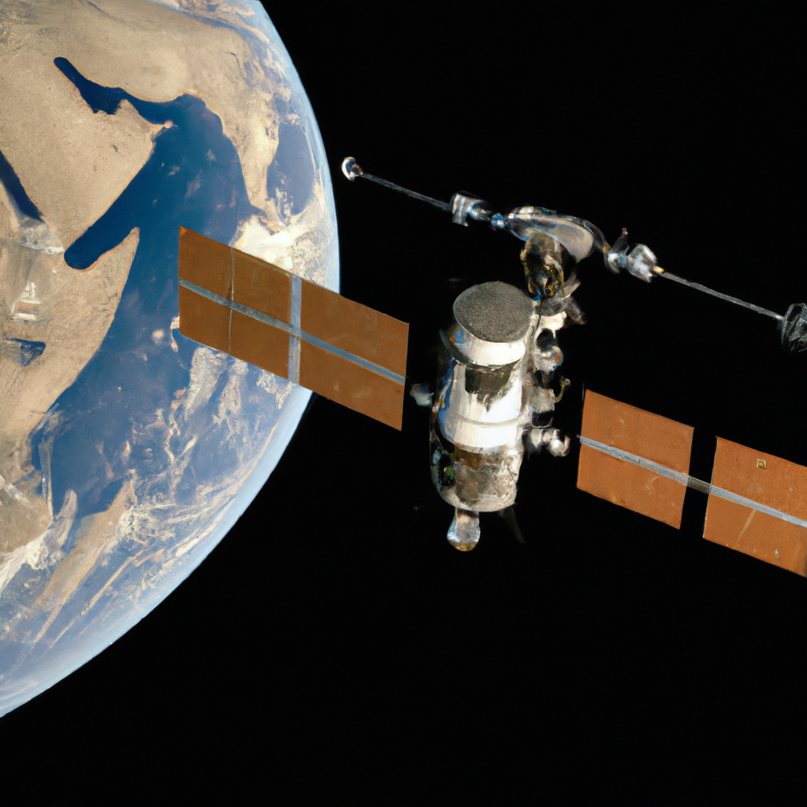

 body {
 font-family: Verdana; 
 }

 .box {
 width: 800px;
 height: 70px;
 border: 2px solid #000;
 margin: 0 auto 20px;
 text-align: center;
 padding: 10px;
 border-radius: 5px;
 }

 .warning {
 background-color: #FFF484;
 border-color: #DCC600;
 }
 .feature {
 float: left;
 padding-right: 15px;
 }
 .full\_feature {
 padding-bottom: 15px;
 }
 

 This blog post was 100% AI generated using <a href="https://www.authorai.org/">AuthorAI</a> API. 
 Powered by OpenAI GPT3 and DALL.E. For demo purposes only.
 
# 
 Reaching for the Stars: How the Mars-Earth Express Will Change Space Exploration

### 
 Mars-Earth Express

 The Mars-Earth Express is a concept for a spacecraft that would travel between Earth and Mars. The spacecraft would be designed to make the journey between the two planets in a matter of weeks, rather than months or years. The spacecraft would be powered by a combination of solar and nuclear energy, and would be equipped with a variety of sensors and instruments to collect data about the planets and their environments.

The spacecraft would be designed to be able to dock with a space station orbiting Mars, allowing astronauts to disembark and explore the planet. The spacecraft would also be able to collect samples from the Martian surface and return them to Earth for analysis.

The Mars-Earth Express would be able to make multiple trips between the two planets, allowing for a continuous flow of data and samples to be exchanged between the two planets. This would allow scientists to gain a better understanding of the environment on Mars, and to develop new technologies to explore the planet.
 

  

## 
*"The Mars-Earth Express is a remarkable concept, reflecting the power of human creativity and imagination. Its potential to unlock the secrets of the Red Planet is remarkable and inspiring, and I am confident it will be an incredible success!" - Stephen Hawking*

  

**Is this concept Sensors Solar Energy a thing?** 

 Yes, solar energy sensors are a real thing. Solar energy sensors are used to measure the amount of solar energy that is available in a given area. They can be used to monitor the amount of energy that is being produced by solar panels, as well as to measure the amount of energy that is being used by a building or other structure.
 

**What is the importance of Space Station?** 

 The International Space Station (ISS) is a critical tool for advancing scientific knowledge and understanding of the universe. It provides a unique environment for conducting experiments in microgravity, which can lead to breakthroughs in a variety of fields, including medicine, materials science, and astrophysics. The ISS also serves as a platform for international collaboration and a stepping stone for future exploration of the solar system. Additionally, the ISS provides a unique opportunity for the public to engage with space exploration and to witness the incredible achievements of
 

**Is there a relationship between Nuclear Energy and Samples?** 

 No, there is no direct relationship between nuclear energy and samples. Nuclear energy is a form of energy produced by splitting atoms, while samples are typically small portions of a larger whole used for testing or analysis.
 

### 
 Leaderboard

| 
 Movies
  | 
 Music Albums
  | 
 Famous People
  |
| --- | --- | --- |
| 
 1. The Martian (2015)
2. Apollo 13 (1995)
3. Alien (1979)
4. Mission to Mars (2000) 
5. Red Planet (2000)
  | 
 1. “Voyager” by Daft Punk 
2. “ Across the Universe” by the Beatles 
3. “Interstellar” by Hans Zimmer 
4. “Cosmos” by Jean Michel Jarre 
5. “Red Planet” by Martin O’Donnell and Michael Salvatori
  | 
 1. Elon Musk – CEO of SpaceX, he proposed the idea of a reusable rocket allowing for more cost effective transportation between Earth and Mars. 
2. Stephen Hawking – Famous physicist who proposed the possibility of a spacecraft that could reach Mars in a matter of weeks.
3. Robert Zubrin – American aerospace engineer, who proposed a mission to Mars using the Mars-Earth Express spacecraft concept.
4. Neil deGrasse Tyson – American astrophysicist and author, who has
  |

---

**Tags:** 

 Spacecraft | Solar Energy | Nuclear Energy | Sensors | Instruments | Space Station | Astronauts | Samples | Data | Technologies
 

