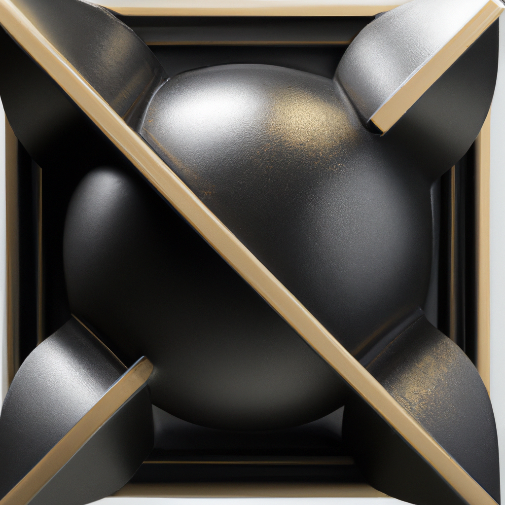

 body {
 font-family: Verdana; 
 }

 .box {
 width: 800px;
 height: 70px;
 border: 2px solid #000;
 margin: 0 auto 20px;
 text-align: center;
 padding: 10px;
 border-radius: 5px;
 }

 .warning {
 background-color: #FFF484;
 border-color: #DCC600;
 }
 .feature {
 float: left;
 padding-right: 15px;
 }
 .full\_feature {
 padding-bottom: 15px;
 }
 

 This blog post was 100% AI generated using <a href="https://www.authorai.org/">AuthorAI</a> API. 
 Powered by OpenAI GPT3 and DALL.E. For demo purposes only.
 
# 
 "Create Balance and Harmony with Metallic Geometric Statues"

### 
 Metallic Geometric Statues

 Metallic Geometric Statues are sculptures made from metal that are composed of geometric shapes. These sculptures can be made from a variety of metals, such as bronze, steel, and aluminum. The sculptures are often abstract in nature, and can range from small to large in size. The sculptures can be used to decorate a home, garden, or public space. They can also be used to create a focal point in a room or garden. The sculptures can be made in a variety of shapes, such as cubes, pyramids, and spheres. The sculptures can also be painted or left in their natural metallic state. Metallic Geometric Statues can be used to create a modern, contemporary look in any space. They can also be used to add a touch of elegance and sophistication to a room. The sculptures can be used to create a unique and eye-catching display. They can also be used to create a sense of balance and harmony in a space.
 

  

## 
*"Art is an expression of the artist's soul through form and shape. Metallic Geometric Statues bring a unique and eye-catching addition to any space, creating a modern and sophisticated atmosphere." -Anonymous*

  

**Is this concept Bronze Pyramid a thing?** 

 No, the concept of a Bronze Pyramid does not appear to be a real thing. It does not appear to be a type of pyramid or structure that exists in the real world.
 

**What is the importance of Aluminum?** 

 Aluminum is an important metal due to its many uses. It is lightweight, strong, and corrosion-resistant, making it ideal for use in a variety of applications, from construction to transportation to packaging. It is also a good conductor of electricity and heat, making it useful in electronics and appliances. Aluminum is also used in the production of many everyday items, such as cans, foil, and kitchen utensils.
 

**Is there a relationship between Sphere and Display?** 

 No, there is no direct relationship between Sphere and Display. Sphere is a 3D shape, while Display is a type of technology used to show images or text on a screen.
 

### 
 Leaderboard

| 
 Movies
  | 
 Music Albums
  | 
 Famous People
  |
| --- | --- | --- |
| 
 1. The Gold Standard (1985)
2. Modern Metallics (2012)
3. Metallic Sculptures (2017)
4. Steelforge (2021)
5. Contours in Metal (2008)
  | 
 1. Metallica – Metallica (1991)
2. System of a Down – Toxicity (2001)
3. Slipknot – Iowa (2001)
4. Nine Inch Nails – The Fragile (1999)
5. Tool – Lateralus (2001)
  | 
 1. Michelangelo - Italian sculptor, painter, architect and poet of the High Renaissance 
2. Auguste Rodin - French sculptor most recognized for his work The Thinker
3. Alexander Calder - American sculptor best known for his mobiles
4. Pablo Picasso - Spanish painter, sculptor, printmaker, ceramicist and stage designer 
5. Henry Moore - English sculptor best known for his semi-abstract monumental bronze sculptures
  |

---

**Tags:** 

 Cube | Pyramid | Sphere | Bronze | Steel | Aluminum | Focal Point | Display | Balance | Harmony
 

